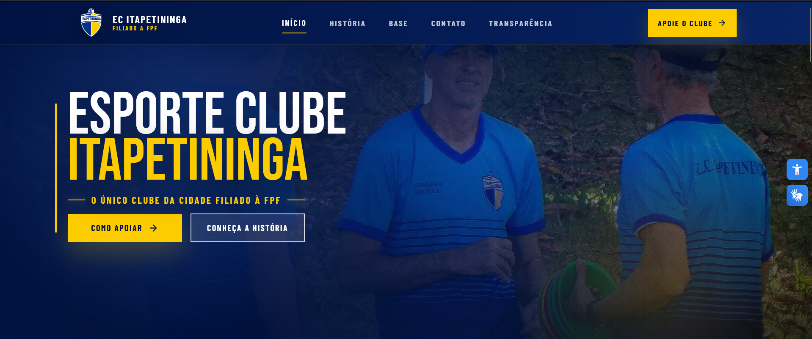

<p align="center">
  
</p>

<h1 align="center">⚽ EC Itapetininga — Site Institucional</h1>

<p align="center">
  Site oficial do <strong>Esporte Clube Itapetininga</strong>, clube fundado em Itapetininga – SP.<br/>
  Desenvolvido com foco em acessibilidade, identidade visual e apresentação institucional.
</p>

<p align="center">
  
  
  
  
</p>

---

## 📋 Sobre o Projeto

Site institucional do **EC Itapetininga (ECI)**, desenvolvido para apresentar a história, os ídolos e a identidade do clube para torcedores, parceiros e imprensa.

O projeto prioriza:

- **Acessibilidade** — conformidade total com WCAG 2.1 nível AA
- **Identidade visual** — fiel às cores e ao legado do clube
- **Apresentação editorial** — seções organizadas e hierarquia tipográfica cuidadosa
- **Transparência institucional** — página dedicada com dados públicos do clube

---

## 🗂️ Estrutura do Projeto

```
Esporte-Clube-Itapetininga/
├── index.html           # Página principal
├── styles.css           # Estilos da página principal
├── transparencia.html   # Página de transparência institucional
├── transparencia.css    # Estilos da página de transparência
├── img/                 # Imagens e ativos visuais
└── previews/
    └── home.png         # Preview do site
```

---

## 📄 Páginas

### `index.html` — Página Principal
Apresenta as seções institucionais do clube:

- **Hero** — chamada visual com identidade do clube
- **Nossa História** — narrativa histórica do ECI
- **Grandes Nomes** — galeria de ídolos e personalidades
- **Arquivo** — galeria de imagens históricas
- **Parceiros** — logos e reconhecimento de patrocinadores
- **Rodapé** — dados institucionais e links

### `transparencia.html` — Transparência
Página dedicada a informações públicas e institucionais do clube, conforme boas práticas de governança.

---

## ♿ Acessibilidade

O site foi desenvolvido seguindo rigorosamente as diretrizes **WCAG 2.1 nível AA**, com ciclos de auditoria e correção cobrindo os quatro princípios:

| Princípio | Status |
|---|---|
| **Perceptível** — contraste, textos alternativos, legendas | ✅ Conforme |
| **Operável** — navegação por teclado, foco visível, skip links | ✅ Conforme |
| **Compreensível** — linguagem clara, labels, hierarquia | ✅ Conforme |
| **Robusto** — HTML semântico, compatibilidade com leitores de tela | ✅ Conforme |

Recursos de acessibilidade integrados:

- **VLibras** — widget de tradução para Língua Brasileira de Sinais (LIBRAS)
- **Painel de acessibilidade** — controles de ajuste de preferências visuais
- Textos alternativos em todas as imagens
- Navegação totalmente operável via teclado
- Estrutura semântica com landmarks ARIA

---

## 🚀 Como Usar

```bash
# Clone o repositório
git clone https://github.com/Aurelio-Dev/Esporte-Clube-Itapetininga.git

# Acesse a pasta
cd Esporte-Clube-Itapetininga

# Abra no navegador
# Basta abrir o arquivo index.html diretamente no browser
```

> Não requer dependências, build tools ou servidor. É um projeto puramente estático em HTML e CSS.

---

## 🛠️ Tecnologias

- **HTML5** semântico
- **CSS3** com variáveis customizadas e layout responsivo
- **VLibras** (widget de acessibilidade em LIBRAS)

---

## 📍 Sobre o Clube

O **Esporte Clube Itapetininga** é um clube de futebol sediado em **Itapetininga, SP**, com história e tradição no futebol do interior paulista.

---
